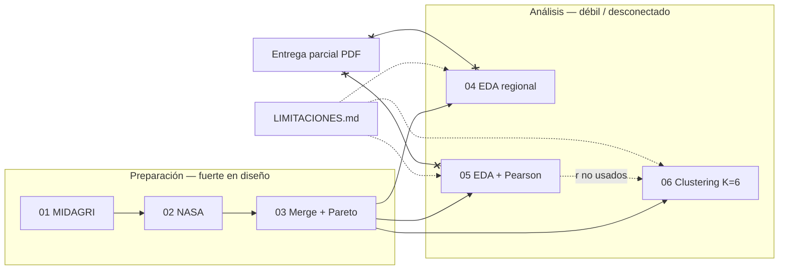

# INFORME PULIDO — Síntesis agentes 1–4

**Fecha:** 2026-06-17  
**Fuentes:** [Agente 1](dc389e08-eaa0-4c57-a26a-7a371494ee74) · [Agente 2](eb2215d8-ec3d-4c99-870d-d7bcbf29815d) · [Agente 3](9b5bf02f-afd9-4d2b-b71c-75215c217229) · [Agente 4](f537ddd5-860c-4c58-99ae-45da264588e3)  
**Objetivo de defensa:** *Pipeline trazable de preprocesamiento a clustering, con limitaciones explícitas y sin claims causales.*

---

## Resumen ejecutivo (4 agentes)

| Agente | Alcance | Veredicto |
|--------|---------|-----------|
| **1** Trazabilidad | 01→06, Run All | **4/10** — arquitectura lógica sólida; ejecución end-to-end rota (Excel ausente, bug 04/05, setup disperso) |
| **2** Ingeniería datos | 01–03 | **Parcial** — MIDAGRI→largo defendible; integración v2 no demostrada en outputs (v1 stale, KeyError en 03) |
| **3** EDA / asociación | 04–05 | **8/15 + 11/15** — notebooks muy delgados vs entrega parcial; Pearson sin BH; sin enlace a 06 |
| **4** Clustering | 06 | **5.5/10** — K=6 defendible; recomendación DBSCAN es cherry-picking (64% ruido); `produccion_total` sesga clusters |

**Conclusión transversal:** el diseño conceptual y `LIMITACIONES.md` van en la dirección correcta, pero hoy **no se puede exponer un Run All limpio** ni defender cifras ancla (33 / 2.376 / 166 / K=6 / Sil≈0,51) contra los notebooks tal como están commiteados.

---

## A. Mapa de coherencia

**Narrativa honesta:** integración MIDAGRI–NASA → perfiles Pareto-80 → tipología descriptiva K=6.  
**No es:** inferencia causal, predicción, sensibilidad agronómica intra-piso, ni ranking confirmado de correlaciones.

---

## B. Top 10 bloqueantes (todos los agentes)

| # | Severidad | Notebook | Problema | Agentes |
|---|-----------|----------|----------|---------|
| 1 | **BLOQUEANTE** | 04, 05 | `OUTPUTS_FIGURES` indefinido → `NameError` al guardar figuras | 1, 3 |
| 2 | **BLOQUEANTE** | 01 | Sin Excel en `BDS/YYYY/` → `ValueError` en concat; sin fail-fast claro | 1 |
| 3 | **BLOQUEANTE** | 03 | Outputs stale v1 (200×7, 30 combos) vs código v2 (210×4, 33 combos); §4 KeyError | 2 |
| 4 | **ALTO** | 06 | Recomienda DBSCAN (Sil=0,86) pese a 64% ruido; contradice §7 | 4 |
| 5 | **ALTO** | 06 | `produccion_total` en features → singleton caña; sin ablación clima-only | 4 |
| 6 | **ALTO** | Repo | Cifras informe (33, 2376, 166) ≠ último run guardado en notebooks | 2 |
| 7 | **ALTO** | 05 | ~165 contrastes Pearson sin BH; parcial usa “determinantes” / % sequía sin celda | 3 |
| 8 | **ALTO** | 01–06 | Setup ROOT disperso; 06 sin rama `SCRIPTS` | 1 |
| 9 | **MEDIO** | 02→03 | Imputación climática en 02 no declarada en 03 (“NaN explícitos”) | 2 |
| 10 | **MEDIO** | Repo | Duplicados `SCRIPTS/*.ipynb`, `.py` huérfanos, tests rotos vs “solo notebooks” | 1, 2 |

---

## C. Matriz de inconsistencias (muestra)

| Tipo | Ubicación A | Ubicación B | Conflicto | Resolución |
|------|-------------|-------------|-----------|------------|
| Cifra | `informe_final.tex`, README | Output 03 guardado | 33 vs 30 perfiles; 2376 vs 2160 filas | Re-ejecutar 03 con v2; limpiar outputs |
| Variable | Celda 1 04/05 | Celda 2/3 04/05 | `RUTA_FIGURES` vs `OUTPUTS_FIGURES` | Unificar nombre |
| Método | 06 §4 vs §7 | Misma notebook | KMeans principal vs “DBSCAN recomendado” | Corregir lógica de recomendación |
| Lenguaje | Entrega parcial | 04–05 | “Determinantes”, % sequía Puno | Alinear o implementar tablas en 05 |
| Mapping | Header 03 | Output §2 | v2_pipeline vs v1 (200,7) | Clear outputs + assert shape |
| Tarea DM | 05 correlaciones | 06 clustering | Top-\|r\| no alimenta features | Celda markdown de contraste explícito |

---

## D. Plan de pulido — 3 días intensivo

| Día | Notebook(s) | Acción | Entregable |
|-----|-------------|--------|------------|
| **1** | 04, 05, 06 | Fixes de una línea (`RUTA_FIGURES`); setup ROOT unificado; validación insumos | 04–06 ejecutan sin NameError |
| **1** | 01, 02 | Fail-fast MIDAGRI; rama cache NASA offline; corregir “12 variables” | README prerequisitos actualizado |
| **2** | 03 | Re-ejecutar con v2; asserts (210,4); demo clima Ica; combos perdidos merge | CSVs 33/2376/166 verificables |
| **2** | 05 | BH en Pearson; tabla % Puno 2021→2022; heatmap correlaciones | `eda_correlaciones_por_cultivo.csv`, `eda_puno_cambios_sequia.csv` |
| **3** | 06 | Fix recomendación DBSCAN; ablación clima-only; estabilidad semillas; alinear §7 | `clustering_perfiles.csv` + narrativa coherente |
| **3** | Todos | Clear all outputs; Run All 01→06; eliminar duplicados SCRIPTS | Pipeline demostrable en vivo |

---

## E. Backlog unificado (top 20)

| # | NB | Celda | Tipo | Descripción | P | Esfuerzo |
|---|-----|-------|------|-------------|---|----------|
| 1 | 04 | 2 | code | `OUTPUTS_FIGURES` → `RUTA_FIGURES` | P0 | 2 min |
| 2 | 05 | 3 | code | Idem figura Puno | P0 | 2 min |
| 3 | 01 | 7–9 | code | `raise FileNotFoundError` si no hay Excel + guía MIDAGRI | P0 | 15 min |
| 4 | 03 | 1–4 | code | Re-ejecutar v2; `assert shape == (210,4)` | P0 | 15 min |
| 5 | 06 | §recom. | code | No recomendar DBSCAN si noise > umbral (p.ej. 20%) | P0 | 20 min |
| 6 | 06 | §4 | code | Ablation: clustering solo clima vs clima+prod | P0 | 45 min |
| 7 | 03 | nueva | code | Demo clima compartido Ica (esparrago vs uva) | P0 | 15 min |
| 8 | 03 | nueva | code | Inventario cultivos perdidos en `dropna(distrito)` | P0 | 20 min |
| 9 | 05 | 2 | code | Columna `p_adj_bh` + flag `clima_compartido` | P1 | 30 min |
| 10 | 05 | nueva | code | Tabla % cambio sequía Puno → CSV | P1 | 20 min |
| 11 | 05 | nueva | fig | Heatmap correlaciones 33×5 | P1 | 30 min |
| 12 | 02 | 0 | md | “12 variables” (no 10) | P1 | 2 min |
| 13 | 02 | 6 | md | Declarar imputación climática post-API | P1 | 10 min |
| 14 | 02 | 3 | code | Rama `if nasa.csv.exists(): read` | P1 | 25 min |
| 15 | 01–06 | 0–1 | code | Plantilla §0 Setup única | P1 | 45 min |
| 16 | 04–06 | 1 | code | Validación insumos estilo 03§3 | P1 | 20 min |
| 17 | 03→06 | final | md | Celdas “próximo paso” con dependencias | P1 | 15 min |
| 18 | 05 | final | md | Enlace explícito (o no-enlace) con 06 | P2 | 10 min |
| 19 | Repo | — | hygiene | Eliminar `SCRIPTS/pipeline_integrado.py`, duplicados ipynb | P2 | 15 min |
| 20 | 04 | nueva | fig | Heatmap estacionalidad o precipitación regional | P2 | 45 min |

---

## F. Checklist pre-exposición (20 ítems)

- [ ] `BDS/YYYY/*.xlsx` presentes o fixture documentado con checksum
- [ ] `OUTPUTS/` vacío → Run All 01→06 completa sin error
- [ ] Mapping cargado = `mapping_cultivo_distrito_v2_pipeline.csv` (210×4)
- [ ] `dataset_integrado.csv`: 2.376 filas × 20 columnas
- [ ] 33 perfiles Pareto; 166 NaN en `produccion_ton`
- [ ] Outputs embebidos limpios (sin rutas `Joyssie`, sin v1 stale)
- [ ] Figuras 04 y 05 se generan en `OUTPUTS/figures/`
- [ ] `eda_correlaciones_por_cultivo.csv` exportado y en repo o regenerable
- [ ] Disclaimer BH / no causalidad visible en 05 celda 0
- [ ] 06 exporta `clustering_perfiles.csv` con K=6
- [ ] Silhouette KMeans ≈ 0,51 citada con contexto (no cherry-pick DBSCAN)
- [ ] §7 de 06 no contradice método principal
- [ ] `LIMITACIONES.md` enlazado en celdas finales 04, 05, 06
- [ ] Sin “determinantes” ni “impacto causal” en markdown de notebooks
- [ ] Entrega parcial alineada con notebooks o marcada como histórica
- [ ] Un solo entry point: `SCRIPTS/notebooks/03` (sin notebook raíz v1)
- [ ] README raíz: prerequisitos red (02) y datos (01) explícitos
- [ ] Demo en vivo ensayada: 03 (merge) + 06 (heatmap) en &lt;20 min
- [ ] Respuesta preparada: clima compartido intra-piso
- [ ] Respuesta preparada: por qué Pearson ≠ clustering features

---

## G. Elevator pitch (≤80 palabras)

Integramos series mensuales MIDAGRI y clima NASA POWER para seis regiones peruanas, construimos un dataset maestro de 2.376 observaciones y 33 perfiles productivos Pareto-80, y agrupamos perfiles en seis tipologías agroclimáticas con K-means. El análisis es **descriptivo y exploratorio**: documenta limitaciones de mapping, clima compartido por piso y ausencia de inferencia causal. No predice rendimientos ni atribuye impacto climático a cultivos individuales.

---

## H. Veredicto final

| Dimensión | Nota 0–10 |
|-----------|-----------|
| Trazabilidad | **4** |
| Ingeniería de datos | **6** (01 fuerte; 03 no verificado) |
| EDA / asociación | **5** |
| Clustering | **5.5** |
| Coherencia narrativa | **4** |
| **¿Listo para exponer pipeline?** | **NO** (→ **PARCIAL** tras fixes P0 días 1–2) |

**Una frase:** Este proyecto es una **tipología exploratoria** de cultivos peruanos en espacio agroclimático-producción; **no** es un estudio causal del clima sobre la agricultura.

---

## Próximo paso recomendado

1. Aplicar fixes P0 del backlog (≈2 h de edición).  
2. Re-ejecutar 01→06 con datos reales.  
3. Actualizar cifras en README / informe solo tras verificar outputs.  
4. Ensayo de defensa con preguntas hostiles de agentes 3 y 4.
